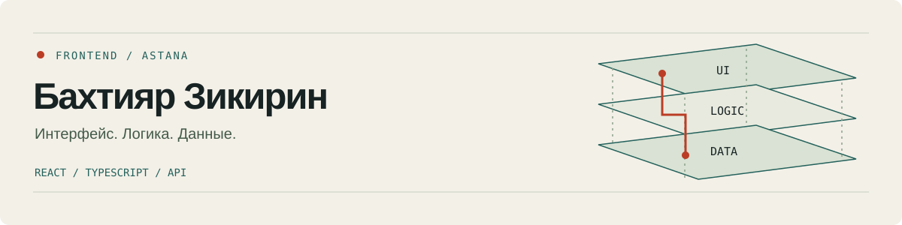

# Бахтияр Зикирин

Frontend-разработчик из Астаны. Работаю с React, TypeScript и REST API. Мне интересно, как приложение ведёт себя после первого клика: загрузка, ошибки, переходы и данные.

**[Портфолио ↗](https://moyisey.github.io/bakhtiyar-zikirin/)** · [Репозитории](https://github.com/MOYISEY?tab=repositories)

## Проекты

### Rowline — CSV до импорта

Подготовьте экспорт для каталога или CRM: очистите значения, найдите ошибки и решите конфликты дубликатов. Правки обратимы; готовые и отклонённые записи выгружаются отдельно. Рецепт очистки можно повторить на следующем файле.

Данные обрабатываются в браузере. Регистрация и сервер для обработки CSV не нужны.

[Попробовать Rowline](https://moyisey.github.io/rowline/) · [Код](https://github.com/MOYISEY/rowline) · [Проверки](https://github.com/MOYISEY/rowline/blob/main/QA.md)

`React` · `TypeScript` · `Web Worker` · `Papa Parse`

### Framepack — изображения для адаптивной вёрстки

Несколько web-размеров из JPEG, PNG и WebP без увеличения исходников. ZIP с изображениями, manifest и srcset; размеры и вес берутся из готовых файлов. Alt пишет пользователь. Обработка в браузере.

[Открыть Framepack](https://moyisey.github.io/framepack/) · [Код](https://github.com/MOYISEY/framepack)

`React` · `TypeScript` · `Canvas` · `Web Worker`

### Shapecheck — проверка JSON-контракта

JSON Schema и положительные/отрицательные примеры, точные пути ошибок и экспорт запускаемых Node-тестов без установки npm-зависимостей. Ограниченное подмножество draft-07; проект сохраняется на устройстве только по выбору.

[Открыть Shapecheck](https://moyisey.github.io/shapecheck/) · [Код](https://github.com/MOYISEY/shapecheck)

`React` · `TypeScript` · `AJV` · `Web Worker`

### Helio — солнце и тени города

Поиск города и выбор точки на реальной карте. Контуры зданий становятся 3D-моделью участка 300 × 300 м; шкала времени меняет солнце и тени. Все высоты — картографические оценки, без обещания точной освещённости. Солнечные расчёты локальны; карта загружается через OpenFreeMap. Есть дополнительный режим открытого горизонта, JSON и ICS.

[Открыть Helio](https://moyisey.github.io/helio/) · [Код](https://github.com/MOYISEY/helio) · [Проверки](https://github.com/MOYISEY/helio/blob/main/evidence/live-map-qa.md)

`React` · `TypeScript` · `Three.js` · `MapLibre` · `Temporal`

### System Atelier — персональное портфолио

Три слоя приложения в интерактивной 3D-сцене: интерфейс, логика и данные. Сцену можно собрать, разделить и проследить путь клика. Есть 2D-режим, управление с клавиатуры и поддержка reduced motion.

[Открыть сайт](https://moyisey.github.io/bakhtiyar-zikirin/) · [Код](https://github.com/MOYISEY/bakhtiyar-zikirin)

`TypeScript` · `Three.js` · `Vite`

### Атырау — тур по кампусу

Панорамная навигация по университету: этажи, локации, переходы между сценами и миниатюры. HTML и JavaScript связывают состояние интерфейса с Pannellum.

[Исходники](https://github.com/MOYISEY/atyrau-tour-3d) · [Разбор в портфолио](https://moyisey.github.io/bakhtiyar-zikirin/#atyrau)

`JavaScript` · `HTML / CSS` · `Pannellum`

### Art Portal — учебный портал работ

Модели публикаций, авторов, категорий, изображений и лайков. В доступном Django-коде — поиск, фильтрация и проверка автора при изменении работы.

[Исходники](https://github.com/MOYISEY/art_portal) · [Структура данных](https://moyisey.github.io/bakhtiyar-zikirin/#artportal)

`Python` · `Django` · `PostgreSQL`

## Опыт

**IQadam Systems** · март — апрель 2026

Frontend-разработка и тестирование: модули, API, SQL, тестовые сценарии и code review.

**Astana Digital Outsource** · май — июнь 2025

Frontend Developer Trainee: React, Tailwind, Material UI и REST API.

## Инструменты

**Интерфейсы:** React, TypeScript, JavaScript, HTML, CSS, Tailwind, Material UI.

**Данные и сервер:** REST API, SQL, PostgreSQL, Python, Django.

**Рабочий процесс:** Git, code review, тестовые сценарии, Trello.

Разбор NeuralBrief — AI-интервью клиента с формированием структурированного ТЗ — тоже есть [в портфолио](https://moyisey.github.io/bakhtiyar-zikirin/#neuralbrief).
